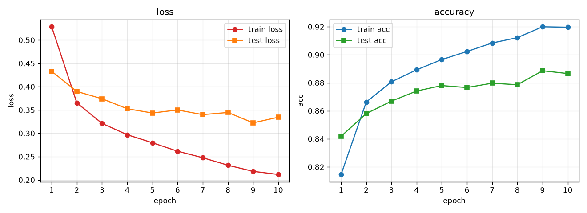
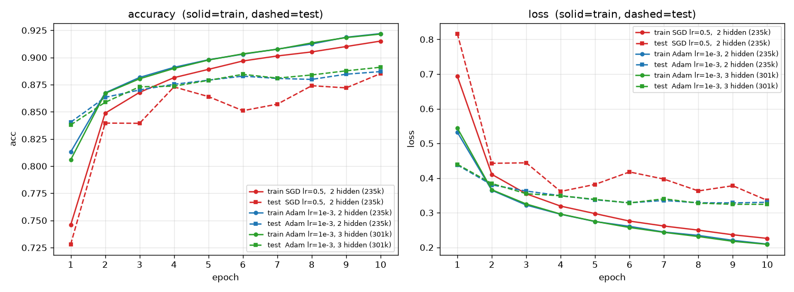
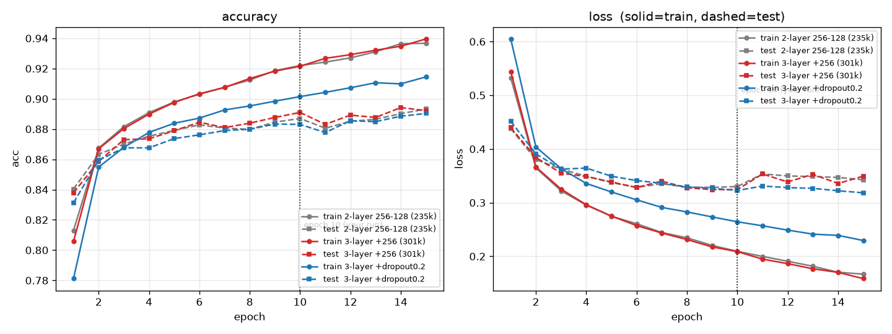

# Fashion-MNIST 图像分类（d2l 复现 + 我的对照实验）

跟《动手学深度学习》(d2l) 敲的 softmax 回归 / MLP 章节，用 GPU 跑 Fashion-MNIST 十分类。

代码本身不是重点 —— 记录的是**我自己实测出来的对照实验结果，和踩过的坑**。下面每个数字都是在这台机器上跑出来的，不是抄教程的。

## 结果

- 模型：`Flatten -> Linear(784,256) -> ReLU -> Linear(256,256) -> ReLU -> Linear(256,128) -> ReLU -> Linear(128,10)`
- 300,938 参数，Adam `lr=1e-3`，batch 256，10 epoch
- 测试集准确率 **89.1%**，train/test gap **+3.05 pt**
- 10 轮约 2.5 分钟（RTX 4060 Laptop）

数据集样例：


基线曲线（2 隐藏层 256-128，Adam lr=1e-3，10 epoch）：



## 对照实验

所有对照都是同一份数据、同一个 `torch.manual_seed(42)`、同一批顺序，只改一个变量。

### 1. 优化器：SGD 还是 Adam

同一个 2 隐藏层网络（784-256-128-10），10 epoch：

| 优化器 | 参数量 | 最后 test acc | train/test gap | 最后 test loss |
|---|---|---|---|---|
| SGD `lr=0.5` | 235,146 | 0.8852 | **+2.99 pt** | 0.3355 |
| Adam `lr=1e-3` | 235,146 | **0.8870** | +3.50 pt | 0.3300 |

逐 epoch test acc：

```
SGD   0.7280 0.8396 0.8394 0.8729 0.8640 0.8510 0.8570 0.8740 0.8720 0.8852
Adam  0.8404 0.8633 0.8701 0.8753 0.8791 0.8828 0.8807 0.8798 0.8846 0.8870
```

- 终点几乎打平（差 0.18 pt），但**过程完全不同**。SGD 的 test acc 在 ±1.5 pt 里来回跳（第 5 到第 6 轮从 0.8640 掉到 0.8510 又回升），test loss 第一轮高达 0.8167、之后 0.44/0.36/0.42 上下翻；Adam 从 0.8404 单调爬到 0.8870，test loss 平滑压到 0.3300。
- 第一轮差距最大：SGD 的 train acc 只有 0.7458，Adam 已经 0.8130。
- 所以「SGD 得给到 0.5」这句话是对的，但 **lr=0.5 的裸 SGD 只是「能走」，很吵**。想让它稳，得配 `momentum=0.9` 或者学习率衰减。

### 2. 隐藏层数：2 层还是 3 层

都用 Adam `lr=1e-3`，10 epoch：

| 网络结构 | 参数量 | test acc | gap | test loss |
|---|---|---|---|---|
| 784-256-128-10（2 隐藏层） | 235,146 | 0.8870 | +3.50 pt | 0.3300 |
| 784-256-256-128-10（3 隐藏层） | 300,938 | **0.8910** | **+3.05 pt** | 0.3242 |

- 多一层换来 **+0.40 pt** test acc，代价是 **+28% 参数**（23.5 万涨到 30.1 万），gap 反而小了 0.45 pt。
- 有收益，但很薄。60k 样本这个量级上，堆层的边际效益已经很低，瓶颈不在容量。



### 3. Dropout 到底有没有用

同 seed(42)、同数据顺序，各跑 15 epoch：

| 配置 | 参数量 | gap@10 | gap@15 | 最好 test acc |
|---|---|---|---|---|
| 2 层 256-128 | 235,146 | +3.50 pt | +4.35 pt | 0.8932 |
| 3 层 256-256-128 | 300,938 | +3.05 pt | +4.74 pt | 0.8942 |
| 3 层 + Dropout(0.2) | 300,938 | **+1.84 pt** | **+2.42 pt** | 0.8903 |

- **Dropout 是唯一起作用的那个**：gap 从 3.05 压到 1.84 pt，test loss 从第 11 轮起不再抬头。
- **多加一层不划算**：多 28% 参数，只换来 best test +0.1 pt。60k 样本配 23 万参数，缺的是正则不是容量。
- 一个反直觉的点：两组**都在第 10 轮见底、第 11 轮 test loss 掉头向上**（0.3242 -> 0.3534）。10 epoch 停手刚好卡在拐点上。



（`dropout_compare.png` 是只改 Dropout 一个变量的 10 epoch 版本。）

### 4. evaluate 放进 batch 循环会怎样

**结果完全不变，但慢到没法用。**

参数逐位相同，不影响精度也不影响最终结果；代价是每个 epoch 多算 235 次测试集，约 6.6 s/次，**每轮多花 26 分钟**。evaluate 就该一个 epoch 调一次。

### 5. loss 前再加一层 Softmax 会更好吗

**会更差，而且是错的。**

`CrossEntropyLoss` 内部已经含 `log_softmax`，再叠一个 `nn.Softmax` 等于 softmax 两次，梯度被压扁：

| | 第一步梯度范数 | 3 epoch 后 acc |
|---|---|---|
| 正确（不加 Softmax） | 0.6547 | 0.8755 |
| 错误（加 Softmax） | 0.0647 | 0.8404 |

梯度小了一个数量级，直接学不动。**损失用 `CrossEntropyLoss` 时，模型里永远不要放 Softmax。**

## 踩过的坑

| 现象 | 原因 | 修法 |
|---|---|---|
| `NameError: name 'e' is not defined` | 把 `1e-3` 写成了 `1-e` | `LR = 1e-3` |
| Dropout 开了跟没开一样 | PyCharm 自动导入成了 `torch.ao.nn.quantized.Dropout`，那是量化推理用的空壳，训练时一个单元都不丢 | 用 `nn.Dropout` |
| `AttributeError: 'Tensor' object has no attribute 'CUDA'` | 没有 `.CUDA()` 这个方法 | `.cpu()` |
| `SyntaxError` | `X = X.to(device), y = y.to(device)`，逗号不是语句分隔符 | 分两行写 |
| d2l `Animator` 直接崩 | IPython 9 删掉了 `display.set_matplotlib_formats` | 开头加 `d2l.use_svg_display = lambda: None` |
| 曲线变「平缓」了，是不是过拟合加重 | 层数变多，同一个 lr 下优化变慢，前期爬得慢 | 判断过拟合看 test loss 有没有掉头，不看 train 曲线的斜率 |
| train loss 在第 2 轮斜率突然变大 | 网络逃出平坦区的正常现象 | 不用管 |

## 文件说明

| 文件 | 说明 |
|---|---|
| `Fashion-MNIST.ipynb` | 主 notebook：数据 / 模型 / 损失 / 优化器 / evaluate / 可视化 / 训练循环 |
| `隐藏层是怎么克服线性模型限制的.ipynb` | d2l MLP 章节笔记 |
| `softmax的简洁实现.ipynb` | d2l softmax 章节笔记 |
| `optimizer_compare.png` | SGD / Adam / 层数 三方对比（10 epoch） |
| `layer_compare.png` | 层数 / Dropout 三组对比（15 epoch） |
| `dropout_compare.png` | 只改 Dropout 的单变量对比（10 epoch） |
| `training_curves.png` | 2 隐藏层 + Adam lr=1e-3 的基线曲线 |
| `fashion_mnist_grid.png` | 数据集样例图 |

## 环境

实测环境：

```
Python      3.14.6
torch       2.13.0+cu126
torchvision 0.28.0+cu126
d2l         1.0.3
numpy       2.4.6
matplotlib  3.11.1
GPU         NVIDIA GeForce RTX 4060 Laptop (CUDA 12.6)
```

复现：

```bash
git clone <this-repo>
cd <this-repo>
uv sync     # pyproject.toml 里配了 pytorch 的 CUDA 索引，会自动装 GPU 版 torch
```

数据第一次跑会自动下载到 `./data`，不需要手动准备。

## 数据

Fashion-MNIST：60,000 训练 / 10,000 测试，28x28 灰度，10 类。
全量统计 `mean=0.2860`、`std=0.3530`，notebook 里 `Normalize` 用的就是这两个数。

## 说明

模型结构和训练流程基于 [d2l-ai/d2l-zh](https://github.com/d2l-ai/d2l-zh)，代码为个人学习复现；对照实验、实测数据与踩坑记录为本人补充。